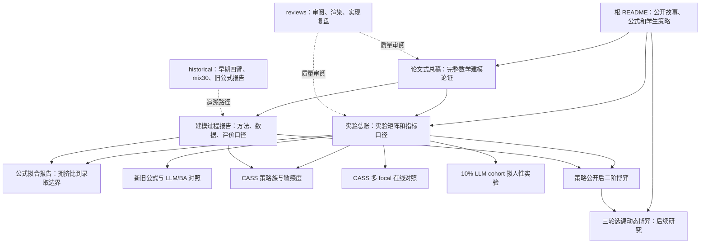

# 报告逻辑与引用关系图

> 日期：2026-04-28
> 目的：说明本项目报告之间的层级、引用方向和证据关系，避免读者把历史报告当当前结论，或把局部实验结果误读成总论。

## 1. 总原则

本项目报告按“入口 -> 总论 -> 实验总账 -> 方法说明 -> 证据报告 -> 审阅报告 -> 历史记录”组织。

引用规则只有三条：

1. **公开结论看 README 和 final 主线**：根 README 负责对外讲故事，final 报告负责承载当前稳定结论。
2. **实验数字看对应 evidence report**：每个具体实验结果必须能追到一篇 interim 或 final 证据报告。
3. **historical 只能追溯，不直接支撑当前口径**：早期报告可以解释研究路径，但不能单独作为当前公开结论的依据。

## 2. 报告层级

| 层级 | 文件 | 角色 | 能不能作为当前结论依据 |
| --- | --- | --- | --- |
| 公开入口 | [根 README](../../README.md) | 面向学生和路人的故事、公式、策略、隐私声明 | 可以，但它是摘要，不是证据 |
| 总论 | [论文式总稿](../final/paper_2026-04-28_course_bidding_math_model.md) | 按数学建模论文结构组织完整论证 | 可以，是当前主论证 |
| 实验账本 | [实验总账与指标口径](../final/report_2026-04-28_experiment_matrix_and_metrics.md) | 汇总做过哪些实验、指标和可比边界 | 可以，是实验导航 |
| 方法说明 | [建模过程报告](../final/report_2026-04-28_modeling_process.md) | 解释合成市场、指标、公式、CASS、实验模式 | 可以，是方法说明 |
| 证据报告 | 2026-04-28 主线 interim 报告 | 每个模型或实验的详细结果 | 可以，需按实验模式引用 |
| 审阅报告 | `reports/reviews/` | 实现、口径、渲染、方法审阅 | 可作质量证明，不作主要实验结论 |
| 历史记录 | 2026-04-27 及更早 interim | 记录试错和被修正的结论 | 只作 historical |

## 3. 引用关系图

读图方式：箭头从“更高层叙事”指向“支撑它的证据或方法”。例如 README 说“新公式在预测层更好”，证据不在 README，而在公式拟合报告和新旧公式对照报告。

## 4. 结论到证据的映射

| 当前结论 | 主要引用 | 辅助引用 |
| --- | --- | --- |
| 网传公式不能作为最终投豆答案，只能作为拥挤信号 | [论文式总稿](../final/paper_2026-04-28_course_bidding_math_model.md) | [all-pay 与公式批判](../interim/allpay_equilibrium_and_formula_critique.md) |
| 新公式预测录取边界比旧公式更稳 | [公式拟合报告](../interim/report_2026-04-28_crowding_boundary_formula_fit.md) | [新旧公式与 LLM/BA 对照](../interim/report_2026-04-28_advanced_boundary_formula_llm_comparison.md) |
| 新公式不能宣传为所有策略场景无条件全胜 | [新旧公式与 LLM/BA 对照](../interim/report_2026-04-28_advanced_boundary_formula_llm_comparison.md) | [实验总账](../final/report_2026-04-28_experiment_matrix_and_metrics.md) |
| CASS-v2 是当前最强规则基准 | [CASS 策略族与敏感度](../interim/report_2026-04-28_cass_sensitivity_analysis.md) | [CASS 多学生回测](../interim/report_2026-04-28_cass_multifocal_llm_batch.md) |
| CASS 更会赢，LLM 更像人 | [10% LLM cohort](../interim/report_2026-04-28_10pct_llm_humanlike_vs_strategy_agents.md) | [大模型学生与策略 Agent 发现](../final/findings_2026-04-28_llm_humanlike_vs_strategy_agents.md) |
| 策略公开后热门课会重新定价 | [二阶博弈报告](../interim/report_2026-04-28_public_strategy_diffusion_game.md) | [论文式总稿](../final/paper_2026-04-28_course_bidding_math_model.md) |
| 真实三轮选课需要独立建模，不能直接套当前单轮结论 | [三轮选课动态博弈研究方向](future_research_three_round_selection_game.md) | [二阶博弈报告](../interim/report_2026-04-28_public_strategy_diffusion_game.md) |
| 所有实验只基于合成数据，不含真实隐私 | [根 README](../../README.md) | [建模过程报告](../final/report_2026-04-28_modeling_process.md) |
| 历史报告有些结论已被收紧 | [走过的弯路与修正](wrong_turns_and_lessons.md) | [报告渲染与 CASS 建模复盘](../reviews/review_2026-04-28_report_rendering_and_cass_modeling.md) |

## 5. 关键报告的职责边界

### 根 README

职责：

- 讲选课规则、网传公式故事、新公式和学生执行策略。
- 用简短数字展示当前结论。
- 链接到主要报告。

不负责：

- 展开完整推导。
- 放所有实验表。
- 证明每一个数字。

### 论文式总稿

职责：

- 把问题建模成非对称信息 all-pay auction。
- 按模型一到模型五组织：旧公式、边界公式、CASS、LLM、策略扩散。
- 给出当前最完整的研究叙事。

不负责：

- 保存所有原始实验输出。
- 替代每个 evidence report 的细表。

### 实验总账

职责：

- 列出所有主要实验。
- 说明指标口径。
- 明确哪些结果可以互比，哪些不能硬比。
- 标出当前实验缺口。

不负责：

- 重新解释全部数学推导。
- 替代具体实验报告。

### 建模过程报告

职责：

- 解释数据、评价指标、agent、公式、CASS 和实验模式。
- 给维护者和复现实验读者提供中层说明。

不负责：

- 做公众传播。
- 放所有实验运行细节。

### Interim 证据报告

职责：

- 记录具体实验设计、主表、诊断指标和结论边界。
- 支撑 final 报告和 README 的具体数字。

不负责：

- 单独承担总论。
- 覆盖其他实验模式。

### Reviews

职责：

- 记录工程审阅、方法审阅、报告渲染复盘。
- 说明某次改动为什么可信、哪里还有风险。

不负责：

- 作为公开结论的主证据。

## 6. Historical 报告怎么引用

Historical 报告包括早期 S048 四臂实验、旧公式 baseline、mix30 公式市场、早期 CASS 与 LLM 对照等。

可以这样引用：

- “早期实验曾显示……，但后续报告已将结论收紧。”
- “该报告用于追溯研究路径，不代表当前最终口径。”
- “这个结果后来被新公式拟合或 CASS 敏感度实验补充验证。”

不要这样引用：

- 单独拿 2026-04-27 的单点实验宣称最终结论。
- 把 replay 和 online 的数字混在一起排总榜。
- 把旧报告中较激进的措辞复制到 README。

## 7. 维护规则

以后新增报告时，按这套规则更新引用关系：

1. 新增实验证据报告后，先更新 [实验总账](../final/report_2026-04-28_experiment_matrix_and_metrics.md)。
2. 如果结论改变，再更新 [论文式总稿](../final/paper_2026-04-28_course_bidding_math_model.md)。
3. 如果影响公众口径，再更新根 [README](../../README.md)。
4. 如果旧报告被推翻或收紧，更新 [走过的弯路与修正](wrong_turns_and_lessons.md)。
5. 如果只是实现或渲染质量检查，放在 `reports/reviews/`，不要把它当实验主报告。

## 8. 最短阅读路径

只想看结论：

1. [根 README](../../README.md)
2. [论文式总稿](../final/paper_2026-04-28_course_bidding_math_model.md)
3. [实验总账](../final/report_2026-04-28_experiment_matrix_and_metrics.md)

想看证据：

1. [公式拟合报告](../interim/report_2026-04-28_crowding_boundary_formula_fit.md)
2. [新旧公式与 LLM/BA 对照](../interim/report_2026-04-28_advanced_boundary_formula_llm_comparison.md)
3. [CASS 策略族与敏感度](../interim/report_2026-04-28_cass_sensitivity_analysis.md)
4. [策略公开后二阶博弈](../interim/report_2026-04-28_public_strategy_diffusion_game.md)
5. [真实三轮选课动态博弈研究方向](future_research_three_round_selection_game.md)

想看研究如何走到现在：

1. [研究路线图](research_journey.md)
2. [走过的弯路与修正](wrong_turns_and_lessons.md)
3. [报告体系审阅与清理记录](../reviews/review_2026-04-28_report_readability_and_cleanup.md)
4. [报告渲染与 CASS 建模复盘](../reviews/review_2026-04-28_report_rendering_and_cass_modeling.md)
